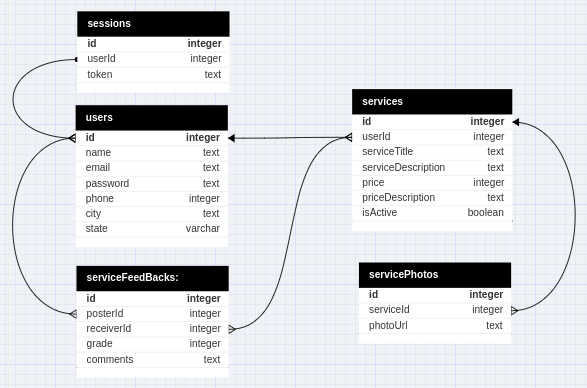

# Get Samurais:

O Get Samurais é uma plataforma com a intenção de conectar pessoas oferecendo serviços e pessoas interessadas nesses serviços, num molde à plataforma GetNinjas.
Este é o repositorio do back-end da aplicação.

# Deploy:

[Link do projeto](https://freela-backend.onrender.com)

# Como funciona?

Este projeto é uma API REST para atender a aplicação de trabalhos Get Samurais. Ela possui as seguintes entidades:

<p align="center">  <p/>

## Onde:

- `Sessions` é responsavel pelas sessões de login de cada usuário.
- `Users` contém os dados de cada usuário.
- `Services` contém os dados de cada trabalho.
- `ServicePhotos` e `serviceHistory` contém informaçõs adicionais para exibição dos trabalhos.

# Rotas:

- POST `/signup`, que recebe no corpo da requisição:
  ```js
  {
    name: string,
    email: string,
    password: string,
    phone: string,
    city: string,
    state: string
  }
  ```

Esta rota é responsavel pela criação de um usuário, e responde com status 201 quando tem sucesso.

- POST `/signin`, que recebe no corpo da requisição:
  ```js
  {
    email: string,
    password: string
  }
  ```

Esta rota é responsavel pelo login, e responde com status 200 quando tem sucesso, além de um token gerado.

- POST `/logged`, que recebe no corpo da requisição:
  ```js
  {
    token: string
  }
  ```

Esta rota é responsavel por checar o login de um usuário para controle do frontend, e responde com status 200 quando tem sucesso.

- GET `/jobs`
  Esta rota é responsavel por receber todos os trabalhos existentes, e responde com status 200 quando tem sucesso com um array de trabalhos.
- GET `/jobs/:id`
  Esta rota é responsavel por analisar um trabalho especifico, e responde com status 200 quando tem sucesso, além do trabalho com todos seus detalhes.
- GET `/me`
  Esta rota é responsavel por checar os trabalhos de um usuário especifico, e responde com status 200 quando tem sucesso, além dos trabalhos do usuario logado.
- POST `/jobs`, que recebe no corpo da requisição:

  ```js
  {
    serviceTitle: string,
    serviceDescription: string,
    price: integer,
    priceDescription: string,
    photoUrl: string,
    isActive: boolean
  }
  ```

Esta rota é responsavel pela criação de um trabalho, e responde com status 201 quando tem sucesso.

# Tecnologias utilizadas

Para este projeto, foram utilizadas:

- Node (v16.20.2);
- Express;
- Postgres;

# Tecnologias à serem incrementadas futuramente:

Para este projeto, foram utilizadas:

- Prisma;
- Typescript;
- Jest e Supertest;

# how to run/Como rodar em desenvolvimento:

Para executar este projeto em desenvolvimento, é necessário seguir os passos abaixo:

- Clonar o repositório;
- Baixar as dependências necessárias com o comando: `npm install`;
- Em seguida, criar o arquivo `.env` com os seguintes elementos:
  - DATABASE_URL="Url do seu banco de dados postgres"
  - PORT="a porta da sua máquina que deseja usar"
- As tabelas podem ser geradas executando o aquivo `dump.sql `no seu banco de dados
- Para rodar o projeto em desenvolvimento, execute o comando `npm run dev`;
- Testes manuais podem ser feitos através do Thunder Client.
