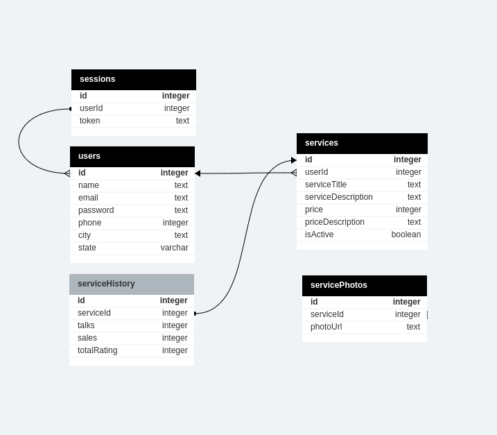

# Get Samurais:
O Get Samurais é uma plataforma com a intenção de conectar pessoas oferecendo serviços e pessoas interessadas nesses serviços, num molde à plataforma GetNinjas.
Este é o repositorio do back-end da aplicação.

# Deploy:
[Link do projeto](https://projeto18-freela-front-sable.vercel.app/)

# Como funciona?
Este projeto é uma API REST para atender a aplicação de trabalhos Get Samurais. Ela possui apenas as seguintes entidades:
<p align="center">  <p/>
  
## Onde:

- Sessions é responsavel pelas sessões de login de cada usuário.
- Users contém os dados de cada usuário.
- Services contém os dados de cada trabalho.
- ServicePhotos e serviceHistory contém informaçõs adicionais para exibição dos trabalhos.

# Rotas:
- POST `/signup`, que recebe no corpo da requisição:
  ```
  {
    name: string,
    email: string,
    password: string,
    phone: string,
    city: string,
    state: string
  }
  ```
- POST `/signin`, que recebe no corpo da requisição:
  ```
  {
    email: string,
    password: string
  }
  ```
- POST `/logged`, que recebe no corpo da requisição:
  ```
  {
    token: string
  }
  ```
- GET `/jobs`
- GET `/jobs/:id`
- GET `/me`
- POST `/jobs`, que recebe no corpo da requisição:
  ```
  {
    serviceTitle: string,
    serviceDescription: string,
    price: integer,
    priceDescription: string,
    photoUrl: string,
    isActive: boolean
  }
  ```

# Tecnologias utilizadas
Para este projeto, foram utilizadas:

- Node;
- Express;
- Postgres;

# Tecnologias à serem incrementadas futuramente:
Para este projeto, foram utilizadas:

- Prisma;
- Typescript;
- Jest e Supertest;


# Como rodar em desenvolvimento
Para executar este projeto em desenvolvimento, é necessário seguir os passos abaixo:

- Clonar o repositório;
- Baixar as dependências necessárias com o comando: `npm install`;
- Em seguida, criar o arquivo `.env` com os seguintes elementos:
  - DATABASE_URL="Url do seu banco de dados postgres"
  - PORT="a porta da sua máquina que deseja usar"
- Para rodar o projeto em desenvolvimento, execute o comando `npm run dev`;
- Testes manuais podem ser feitos através do Thunder Client.
